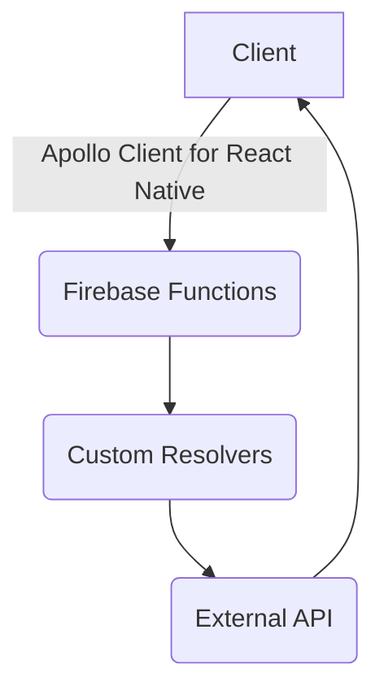

# HabitatAPI

This is the backend interface for "whatBill" - responsible for connecting the whatBill client to Firestore, Plaid, and Stripe. 

It uses GraphQL, built on Apollo Server, and deployed as a Google Cloud Function invoked by HTTPS. Custom resolvers connect queries and mutations to external APIs, as well as allow for easy relational data in Cloud Firestore. 

# Flow

Frameworks and Libraries
-
- Apollo Server 
- Google Cloud Functions
- Firebase Firestore
- Firebase Auth
- Plaid API
- Stripe Connect

"gcloud functions deploy habitatapi --entry-point handler --runtime nodejs14 --trigger-http"

